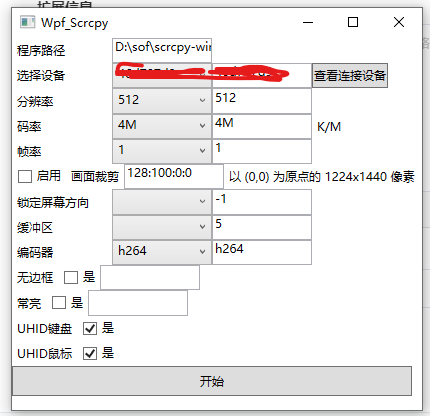

# WPFscrcpy

#### 介绍
安卓投屏工具
用c# wpf封装一下  Scrcpy这个工具  本来有很多其他的工具的 但是感觉用起来一般还有很多都收费 
所以我想自己弄一个
大概查了一下 大部分功能  Scrcpy 都封装好了  只需要做个前台管理的界面就行了
有兴趣的也可以进来增加功能  还准备以后开发一些群控  还有界面管理之类的功能
大家都出一份力可以做的更好

至于功能什么的可以看这个页面https://gitee.com/mirrors/scrcpy
国外的看这里https://github.com/Genymobile/scrcpy

Encapsulate Scrcpy with C # WPF for Android screen casting tools. Originally, there were many other tools available, but I feel that there are still many charges when using them. So, I want to make a rough check myself. Most of the functions Scrcpy are packaged and only need to be created as a front-end management interface. If you are interested, you can come in and add more functions. We are also preparing to develop some group control and interface management functions in the future. Everyone can contribute and do better

As for the functions, you can refer to this page https://gitee.com/mirrors/scrcpy Look here for those from abroad https://github.com/Genymobile/scrcpy

需要自行下载Scrcpy
放在 D:\sof\scrcpy-win64-v1.17 这个目录下面 其实你放哪里都可以，只要自己设置好路径就好了

这个软件的主要特点就是自定义参数  没有限制啥的 都可以自己输入

#### 软件架构
软件架构说明

#### 安装教程

1.  需要.NET 4.52 +
2.  打开即可使用

#### 使用说明

1.  点击查看连接设备(首先你得连接安卓手机  不会的请百度)
2.  选中设备
3.  选择参数
4.  点开始

#### 参与贡献

1.  Fork 本仓库
2.  新建 Feat_xxx 分支
3.  提交代码
4.  新建 Pull Request

#### 更新记录
2024-4-30 将程序完全打包，懒人可以不用下载打开即可使用
2024-4-30 增加了 hud键盘鼠标的适配

#### 特技

1.  使用 Readme\_XXX.md 来支持不同的语言，例如 Readme\_en.md, Readme\_zh.md
2.  Gitee 官方博客 [blog.gitee.com](https://blog.gitee.com)
3.  你可以 [https://gitee.com/explore](https://gitee.com/explore) 这个地址来了解 Gitee 上的优秀开源项目
4.  [GVP](https://gitee.com/gvp) 全称是 Gitee 最有价值开源项目，是综合评定出的优秀开源项目
5.  Gitee 官方提供的使用手册 [https://gitee.com/help](https://gitee.com/help)
6.  Gitee 封面人物是一档用来展示 Gitee 会员风采的栏目 [https://gitee.com/gitee-stars/](https://gitee.com/gitee-stars/)
